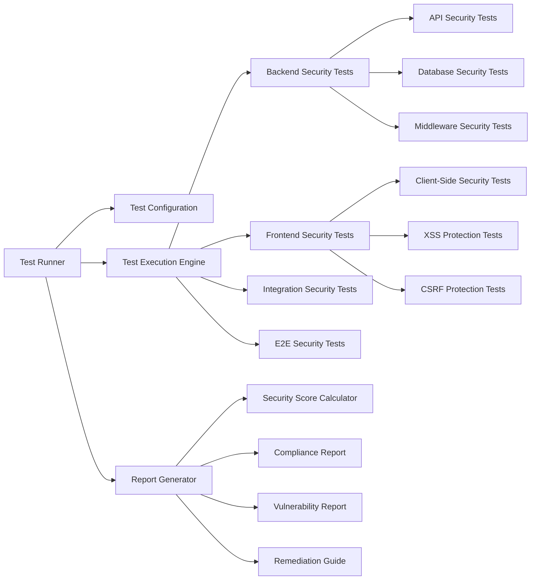

# Design Document

## Overview

The comprehensive security testing suite will be built as a modular testing framework that integrates with the existing trade inquiry order system. It will provide automated security testing capabilities including vulnerability scanning, penetration testing, authentication/authorization testing, input validation testing, and security monitoring validation. The suite will be designed to run both as part of the CI/CD pipeline and as standalone security assessments.

The design leverages the existing security infrastructure including helmet security headers, rate limiting, input sanitization, SQL injection prevention, file upload security, and comprehensive logging systems. The testing suite will validate these security controls and identify gaps or vulnerabilities.

## Architecture

### Core Components

```mermaid
graph TB
    A[Security Test Suite] --> B[Vulnerability Scanner]
    A --> C[Authentication Tester]
    A --> D[Authorization Tester]
    A --> E[Input Validation Tester]
    A --> F[Security Monitoring Tester]
    A --> G[Data Protection Tester]
    A --> H[Performance Security Tester]
    
    B --> I[OWASP Top 10 Scanner]
    B --> J[Dependency Scanner]
    B --> K[Configuration Scanner]
    
    C --> L[JWT Token Tester]
    C --> M[Session Management Tester]
    C --> N[Password Policy Tester]
    
    D --> O[RBAC Tester]
    D --> P[Endpoint Access Tester]
    D --> Q[Resource Permission Tester]
    
    E --> R[SQL Injection Tester]
    E --> S[XSS Tester]
    E --> T[File Upload Tester]
    E --> U[Input Sanitization Tester]
    
    F --> V[Logging Validator]
    F --> W[Alert System Tester]
    F --> X[Audit Trail Tester]
    
    G --> Y[Encryption Tester]
    G --> Z[Data Access Logger]
    G --> AA[Retention Policy Tester]
    
    H --> BB[Rate Limit Tester]
    H --> CC[Load Security Tester]
    H --> DD[Resource Exhaustion Tester]
```



### Testing Framework Architecture



## Components and Interfaces

### 1. Security Test Suite Core

**Interface: ISecurityTestSuite**
```typescript
interface ISecurityTestSuite {
  runAllTests(): Promise<SecurityTestResult>;
  runTestCategory(category: SecurityTestCategory): Promise<SecurityTestResult>;
  generateReport(results: SecurityTestResult[]): SecurityReport;
  getSecurityScore(results: SecurityTestResult[]): SecurityScore;
}

interface SecurityTestResult {
  testName: string;
  category: SecurityTestCategory;
  status: 'PASS' | 'FAIL' | 'WARNING';
  severity: 'LOW' | 'MEDIUM' | 'HIGH' | 'CRITICAL';
  description: string;
  evidence?: any;
  remediation: string;
  cweId?: string;
  owaspCategory?: string;
}

interface SecurityReport {
  summary: SecuritySummary;
  results: SecurityTestResult[];
  complianceStatus: ComplianceStatus;
  recommendations: string[];
  generatedAt: Date;
}
```

### 2. Vulnerability Scanner

**Interface: IVulnerabilityScanner**
```typescript
interface IVulnerabilityScanner {
  scanOWASPTop10(): Promise<SecurityTestResult[]>;
  scanDependencies(): Promise<SecurityTestResult[]>;
  scanConfiguration(): Promise<SecurityTestResult[]>;
  scanCustomVulnerabilities(): Promise<SecurityTestResult[]>;
}
```

**Implementation Strategy:**
- Integrate with existing security middleware to test effectiveness
- Use automated tools like OWASP ZAP API for dynamic scanning
- Implement custom vulnerability checks specific to the trade inquiry system
- Scan for SQL injection, XSS, CSRF, insecure direct object references
- Check for security misconfigurations in Express.js, database, and Redis

### 3. Authentication & Authorization Tester

**Interface: IAuthTester**
```typescript
interface IAuthTester {
  testJWTSecurity(): Promise<SecurityTestResult[]>;
  testSessionManagement(): Promise<SecurityTestResult[]>;
  testPasswordPolicies(): Promise<SecurityTestResult[]>;
  testRoleBasedAccess(): Promise<SecurityTestResult[]>;
  testEndpointPermissions(): Promise<SecurityTestResult[]>;
}
```

**Implementation Strategy:**
- Test JWT token validation, expiration, and refresh mechanisms
- Validate session timeout and invalidation
- Test role-based access control for all endpoints
- Verify permission checks for resources (inquiries, quotations, orders)
- Test privilege escalation scenarios

### 4. Input Validation Tester

**Interface: IInputValidationTester**
```typescript
interface IInputValidationTester {
  testSQLInjection(): Promise<SecurityTestResult[]>;
  testXSSProtection(): Promise<SecurityTestResult[]>;
  testFileUploadSecurity(): Promise<SecurityTestResult[]>;
  testInputSanitization(): Promise<SecurityTestResult[]>;
  testParameterPollution(): Promise<SecurityTestResult[]>;
}
```

**Implementation Strategy:**
- Use payload libraries for SQL injection and XSS testing
- Test file upload restrictions and malware detection
- Validate input sanitization effectiveness
- Test parameter pollution and HTTP parameter pollution
- Verify CSRF protection mechanisms

### 5. Security Monitoring Tester

**Interface: ISecurityMonitoringTester**
```typescript
interface ISecurityMonitoringTester {
  testSecurityLogging(): Promise<SecurityTestResult[]>;
  testAlertSystem(): Promise<SecurityTestResult[]>;
  testAuditTrails(): Promise<SecurityTestResult[]>;
  testLogIntegrity(): Promise<SecurityTestResult[]>;
}
```

**Implementation Strategy:**
- Validate that security events are properly logged
- Test alert generation for suspicious activities
- Verify audit trail completeness and integrity
- Test log tampering protection
- Validate log retention and rotation policies

### 6. Data Protection Tester

**Interface: IDataProtectionTester**
```typescript
interface IDataProtectionTester {
  testEncryption(): Promise<SecurityTestResult[]>;
  testDataAccess(): Promise<SecurityTestResult[]>;
  testDataRetention(): Promise<SecurityTestResult[]>;
  testDataExport(): Promise<SecurityTestResult[]>;
  testPIIProtection(): Promise<SecurityTestResult[]>;
}
```

**Implementation Strategy:**
- Verify encryption at rest and in transit
- Test data access logging and controls
- Validate data retention and deletion policies
- Test secure data export functionality
- Verify PII protection and anonymization

## Data Models

### Security Test Configuration

```typescript
interface SecurityTestConfig {
  testSuites: {
    vulnerability: VulnerabilityTestConfig;
    authentication: AuthTestConfig;
    authorization: AuthzTestConfig;
    inputValidation: InputValidationTestConfig;
    monitoring: MonitoringTestConfig;
    dataProtection: DataProtectionTestConfig;
    performance: PerformanceSecurityTestConfig;
  };
  environment: {
    baseUrl: string;
    testCredentials: TestCredentials;
    databaseConfig: TestDatabaseConfig;
    redisConfig: TestRedisConfig;
  };
  reporting: {
    outputFormat: 'JSON' | 'HTML' | 'PDF';
    includeEvidence: boolean;
    complianceFrameworks: string[];
  };
}

interface TestCredentials {
  admin: { username: string; password: string };
  buyer: { username: string; password: string };
  supplier: { username: string; password: string };
  invalidUser: { username: string; password: string };
}
```

### Security Test Payloads

```typescript
interface SecurityPayloads {
  sqlInjection: string[];
  xssPayloads: string[];
  pathTraversal: string[];
  commandInjection: string[];
  fileUploadMalicious: Buffer[];
  headerInjection: string[];
  parameterPollution: Record<string, any>[];
}
```

## Error Handling

### Security Test Error Handling

```typescript
class SecurityTestError extends Error {
  constructor(
    message: string,
    public testName: string,
    public category: SecurityTestCategory,
    public severity: SecuritySeverity,
    public originalError?: Error
  ) {
    super(message);
    this.name = 'SecurityTestError';
  }
}

class SecurityTestTimeoutError extends SecurityTestError {
  constructor(testName: string, timeout: number) {
    super(`Security test '${testName}' timed out after ${timeout}ms`, testName, 'PERFORMANCE', 'MEDIUM');
    this.name = 'SecurityTestTimeoutError';
  }
}

class SecurityTestConfigError extends SecurityTestError {
  constructor(message: string, configKey: string) {
    super(`Security test configuration error: ${message} (key: ${configKey})`, 'CONFIG', 'CONFIGURATION', 'HIGH');
    this.name = 'SecurityTestConfigError';
  }
}
```

### Error Recovery Strategies

- **Test Isolation**: Each security test runs in isolation to prevent cascading failures
- **Graceful Degradation**: If one test category fails, others continue to run
- **Retry Logic**: Implement retry mechanisms for network-dependent tests
- **Fallback Reporting**: Generate partial reports even if some tests fail
- **Error Aggregation**: Collect and categorize all errors for comprehensive reporting

## Testing Strategy

### Unit Tests for Security Components

```typescript
// Example test structure
describe('SecurityTestSuite', () => {
  describe('VulnerabilityScanner', () => {
    it('should detect SQL injection vulnerabilities');
    it('should identify XSS vulnerabilities');
    it('should scan for OWASP Top 10 issues');
  });
  
  describe('AuthenticationTester', () => {
    it('should validate JWT token security');
    it('should test session management');
    it('should verify password policies');
  });
  
  describe('AuthorizationTester', () => {
    it('should test RBAC implementation');
    it('should verify endpoint permissions');
    it('should detect privilege escalation');
  });
});
```

### Integration Tests

- **API Security Integration**: Test security middleware integration with API endpoints
- **Database Security Integration**: Test database security controls and query protection
- **File System Security Integration**: Test file upload and storage security
- **External Service Security Integration**: Test security of external API integrations

### End-to-End Security Tests

- **Complete Attack Scenarios**: Simulate real-world attack scenarios
- **Multi-Step Security Flows**: Test complex security workflows
- **Cross-Component Security**: Test security across frontend and backend
- **Performance Under Attack**: Test system behavior under security stress

### Continuous Security Testing

- **CI/CD Integration**: Automated security tests in deployment pipeline
- **Scheduled Security Scans**: Regular vulnerability assessments
- **Security Regression Testing**: Ensure security fixes don't break functionality
- **Security Monitoring Validation**: Continuous validation of security controls

### Test Data Management

- **Secure Test Data**: Use anonymized or synthetic data for security tests
- **Test Environment Isolation**: Separate security testing environment
- **Credential Management**: Secure handling of test credentials
- **Data Cleanup**: Proper cleanup of test data after security tests

### Reporting and Compliance

- **Security Dashboards**: Real-time security test results
- **Compliance Reports**: Generate reports for regulatory compliance
- **Trend Analysis**: Track security posture over time
- **Executive Summaries**: High-level security status reports
- **Remediation Tracking**: Track security issue resolution